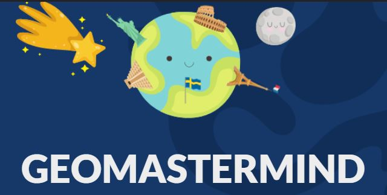
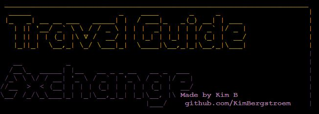

# KIM BERGSTROM
## Student Software Developer

### About Me

Kim, Student Developer at Code Institute 👋🏻

With a passion for coding and an unwavering dedication to mastering the art of front-end development.

A fast learner with a thirst for knowledge, I thrives on the challenge of mastering new programming languages and tools. But it's during the dark, quiet hours of the night that I truly shines, delving deep into code and pushing the boundaries of what's possible, the possibilities are endless. :full_moon: 🌆.
I also loves connecting with other gamers and building a community around their shared passion as my hobbies besides programming are gaming. Streaming and playing video games with friends over twitch is second passion in my life. 🎮 👾

- - -

### Contact Me

I've also recently started streaming about coding/games and other related topics. If you'd like to have a look you can find my link below:

- - -

### My Tech Stack

#### 👤 I'm Currently Learning

#### 🎨 Designs & Wireframes

#### < > Programming Languages

#### 📚 Libraries & Frameworks

#### 🗃 Databases

<!--- #### 🧪 Testing

 -->

#### 💻 Version Control, IDE's & Other Coding Content 

**Personal Setup:** 

**Work Setup:** 

- - - 

### Milestone Projects for Code Institute Diploma

**Overall Diploma Grade:** 

| Milestone No.   | Project | Description | Grade | 
| :-----------: | :-----------: | :-----------: | :-----------: |
| 1 | 

Max_Fps Cafe
 | 
A website created for the internet cyber cafe, a local gaming community who play together. Created using HTML, CSS. | MERIT |
| 2 | 

geoMastermind
 | 
Exciting mini game, built with JavaScript as base and HTML/CSS, challenges you to answer ten questions about locations, landmarks, cultures, and more from around the world. | Ongoing |
| 3 | 

travel_Guide
 | 
The Currency Exchanger and Travel Guide is a , Python-based 🐍 application that allows users to convert between different currencies and also engages them with a fun travel experience. | Ongoing |

- - -

  

